# Sokoban AI – Trực quan hóa và so sánh thuật toán tìm kiếm

## 0. Chạy nhanh

Dự án này mô phỏng game **Sokoban** và trực quan hóa nhiều nhóm thuật toán tìm kiếm trong Trí tuệ nhân tạo. Người chơi/agent cần đẩy thùng vào đúng ô đích. Chương trình cho phép chọn level, chọn thuật toán, chạy tự động lời giải, xem log xử lý, xem đường đi trên bản đồ và so sánh kết quả giữa các thuật toán trong cùng nhóm.

### 0.1. File chạy chính

```bash
python main.py
```

### 0.2. Cài thư viện cần thiết

Dự án dùng Python. Trên Windows, `tkinter` thường đã đi kèm Python. Thư viện ngoài quan trọng nhất là `pygame`.

```bash
python -m pip install pygame
```

Nếu muốn kiểm tra nhanh lỗi cú pháp trước khi nộp:

```bash
python -m py_compile main.py assets.py game.py solver.py algorithm\*.py
```

---

### 0.3. Ảnh giao diện chính

Dưới đây là ảnh giao diện tổng quan của chương trình:

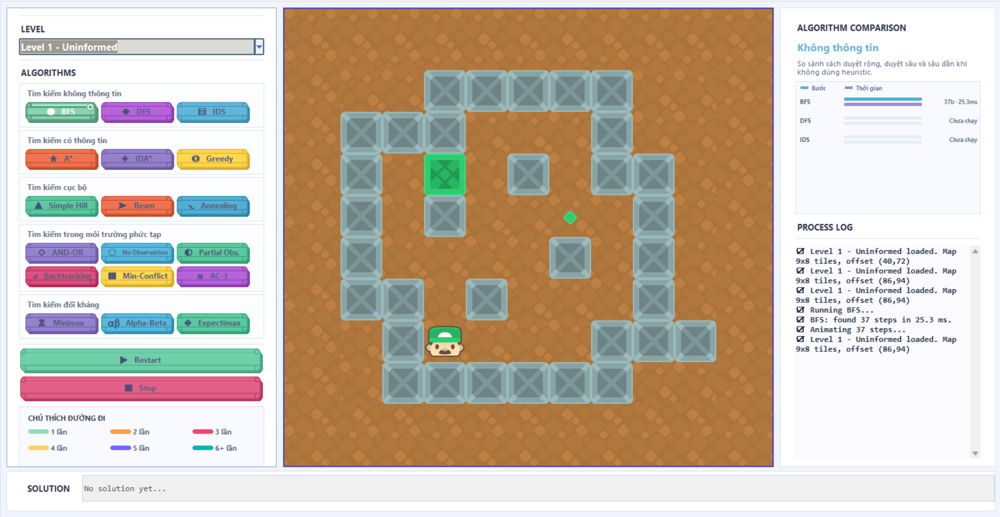

### 0.4. GIF minh họa các thuật toán

Các file GIF demo đã có sẵn trong thư mục `GIF/`. Có thể xem trực tiếp ngay trong `README` khi mở trên GitHub hoặc các nền tảng hỗ trợ Markdown hiển thị ảnh động.

#### Nhóm tìm kiếm không thông tin

<p align="center">
  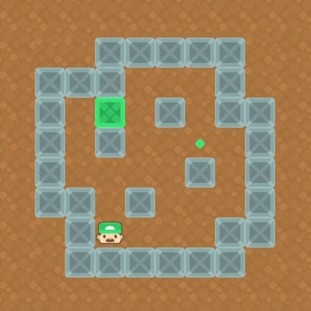
  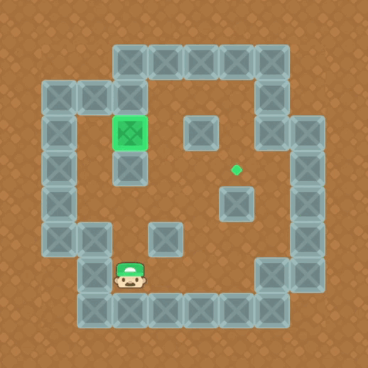
  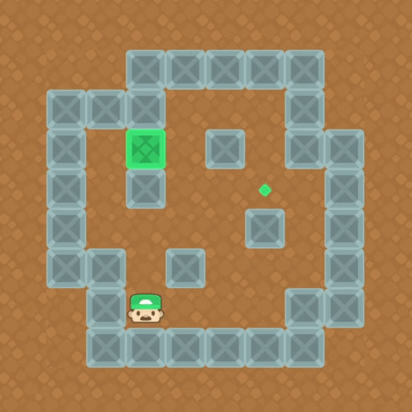
</p>
<p align="center"><b>BFS</b> &nbsp;&nbsp;&nbsp; <b>DFS</b> &nbsp;&nbsp;&nbsp; <b>IDS</b></p>

#### Nhóm tìm kiếm có thông tin

<p align="center">
  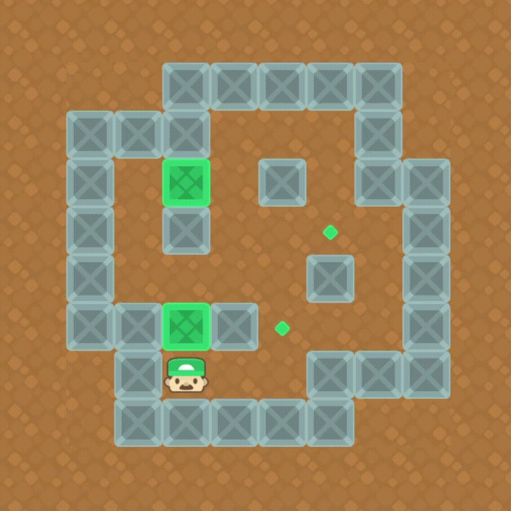
  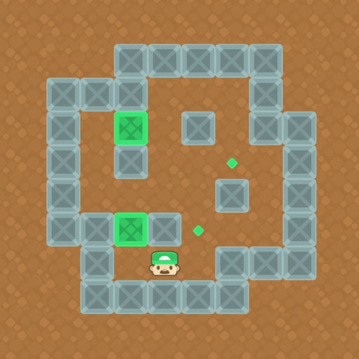
  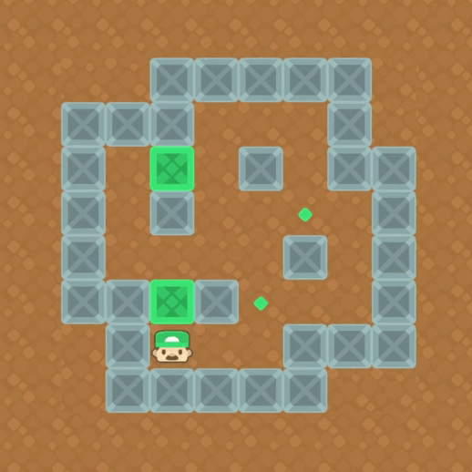
</p>
<p align="center"><b>A*</b> &nbsp;&nbsp;&nbsp; <b>Greedy</b> &nbsp;&nbsp;&nbsp; <b>IDA*</b></p>

#### Nhóm tìm kiếm cục bộ

<p align="center">
  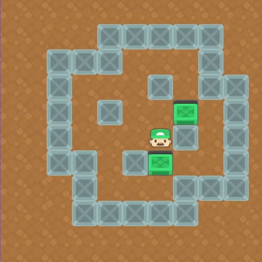
  
  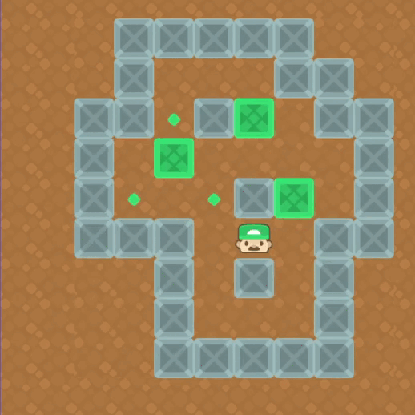
</p>
<p align="center"><b>Simple Hill</b> &nbsp;&nbsp;&nbsp; <b>Local Beam</b> &nbsp;&nbsp;&nbsp; <b>Simulated Annealing</b></p>

#### Nhóm môi trường phức tạp / CSP

<p align="center">
  
  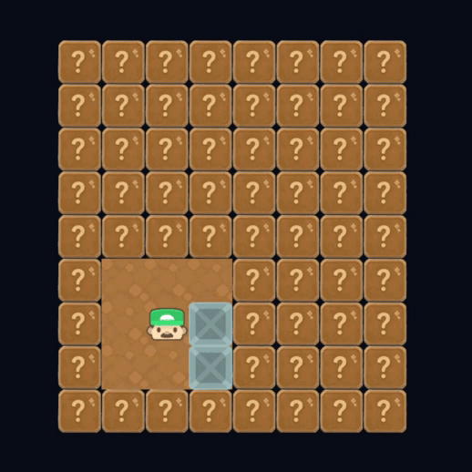
  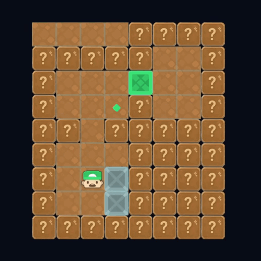
</p>
<p align="center"><b>AND-OR</b> &nbsp;&nbsp;&nbsp; <b>No Observation</b> &nbsp;&nbsp;&nbsp; <b>Partial Observation</b></p>

<p align="center">
  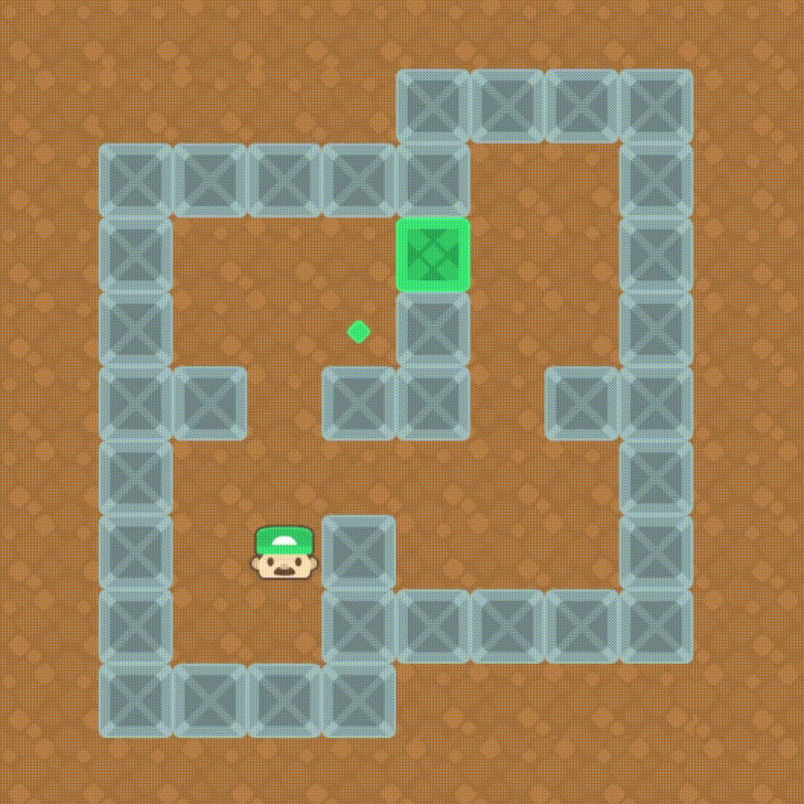
  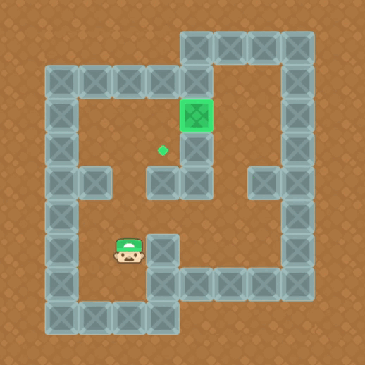
  
</p>
<p align="center"><b>Backtracking</b> &nbsp;&nbsp;&nbsp; <b>Min-Conflict</b> &nbsp;&nbsp;&nbsp; <b>AC-3</b></p>

#### Nhóm tìm kiếm đối kháng

<p align="center">
  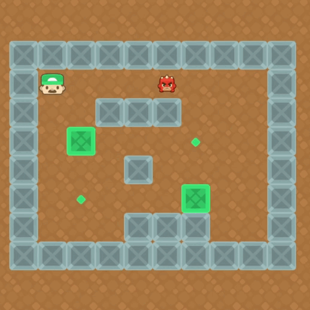
  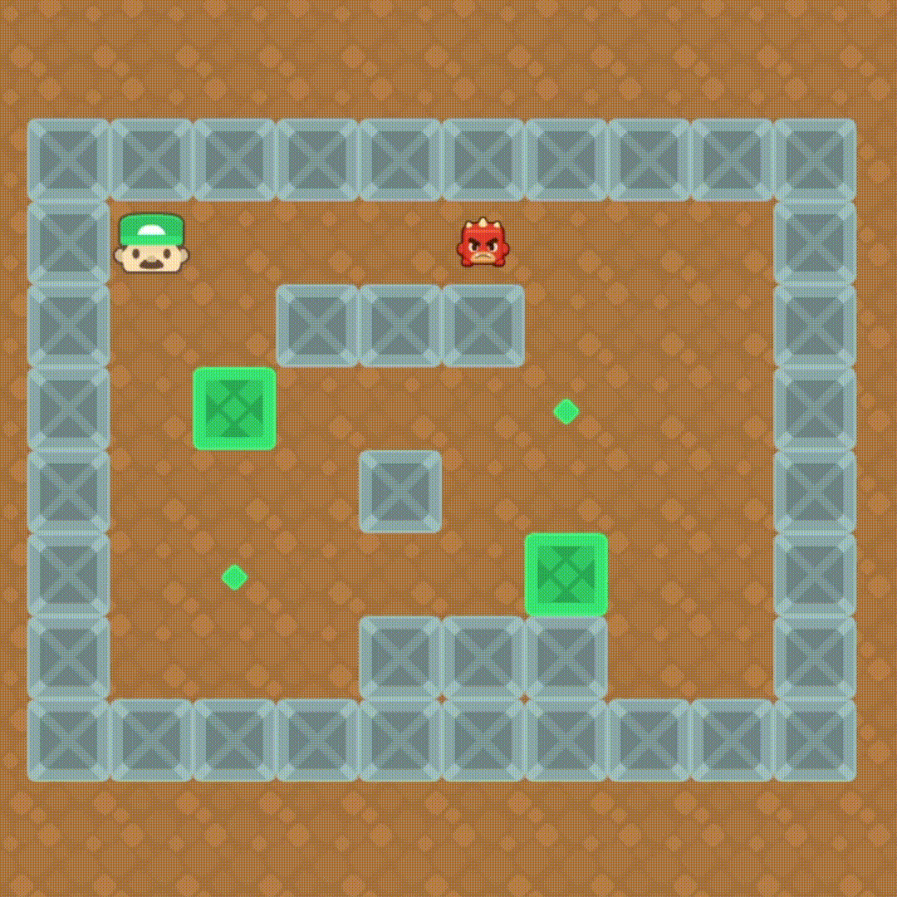
  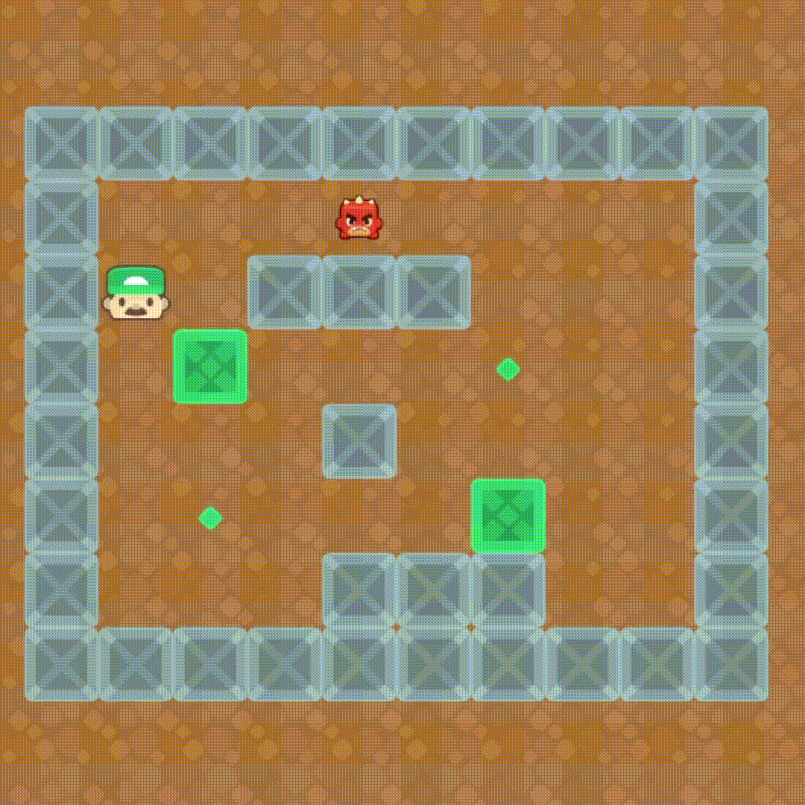
</p>
<p align="center"><b>Minimax</b> &nbsp;&nbsp;&nbsp; <b>Alpha-Beta</b> &nbsp;&nbsp;&nbsp; <b>Expectimax</b></p>

---

## 1. Thông tin dự án

| Mục | Nội dung |
|---|---|
| Tên dự án | Sokoban AI |
| Chủ đề | Trực quan hóa thuật toán tìm kiếm trong game Sokoban |
| Ngôn ngữ | Python |
| Giao diện | Tkinter + Pygame |
| Dữ liệu bản đồ | File `.txt` trong thư mục `levels/` |
| Sprite game | File `.png` trong thư mục `assets/sprites/` |
| File chạy chính | `main.py` |
| File lõi trạng thái | `solver.py`, `game.py` |
| File thuật toán | Thư mục `algorithm/` |

---

## 2. Mục tiêu của dự án

Dự án được xây dựng nhằm phục vụ bài học về các nhóm thuật toán tìm kiếm trong AI thông qua một môi trường trực quan là game Sokoban.

Các mục tiêu chính:

1. **Mô phỏng game Sokoban** với người chơi, thùng, tường, ô đích và một số biến thể như ô chưa biết hoặc đối thủ.
2. **Cài đặt nhiều nhóm thuật toán tìm kiếm**, gồm tìm kiếm không thông tin, tìm kiếm có thông tin, tìm kiếm cục bộ, môi trường phức tạp, CSP và tìm kiếm đối kháng.
3. **Trực quan hóa lời giải** bằng animation trên giao diện.
4. **So sánh thuật toán** theo số bước, thời gian chạy, khả năng tìm lời giải và ý nghĩa học thuật.
5. **Hỗ trợ trình bày/báo cáo** bằng log xử lý, biểu đồ so sánh và đường đi màu trên bản đồ.

---

## 3. Bài toán Sokoban trong dự án

Sokoban là bài toán tìm đường trong không gian trạng thái. Agent phải di chuyển trong bản đồ dạng lưới và đẩy các thùng vào ô đích.

### 3.1. Ký hiệu bản đồ

Các level được lưu bằng file text trong thư mục `levels/`.

| Ký hiệu | Ý nghĩa | Sprite tương ứng |
|---|---|---|
| `#` | Tường | `wall.png` |
| `@` | Người chơi / worker | `worker.png` |
| `$` | Thùng | `box.png` |
| `.` | Ô đích | `dock.png` |
| `*` | Thùng đã nằm trên ô đích | `box_docked.png` |
| `E` | Đối thủ / competitor | `competitor.png` |
| `?` | Ô chưa biết / vùng bị che quan sát | `blind_box.png` |
| khoảng trắng | Sàn trống | `floor.png` |

### 3.2. Hành động

Agent có 4 hành động cơ bản:

| Hành động | Ký hiệu trong lời giải | Ý nghĩa |
|---|---|---|
| Up | `U` | Đi lên |
| Down | `D` | Đi xuống |
| Left | `L` | Đi sang trái |
| Right | `R` | Đi sang phải |

Nếu ô kế tiếp là sàn hoặc đích thì người chơi di chuyển. Nếu ô kế tiếp là thùng và phía sau thùng là sàn hoặc đích thì người chơi đẩy thùng.

### 3.3. Trạng thái đích

Trạng thái đích đạt được khi tất cả thùng đều nằm trên ô đích. Trong code, trạng thái hoàn thành được kiểm tra qua điều kiện không còn thùng thường `$`, hoặc tất cả vị trí dock đều có `*` tùy ngữ cảnh hiển thị/chạy.

---

## 4. Cấu trúc thư mục

```text
Sokoban_AI-main/
├── main.py
│   └── File chạy chính, xây dựng giao diện, chọn level, chọn thuật toán, chạy animation và so sánh.
├── game.py
│   └── Quản lý hiển thị bản đồ, sprite, thao tác di chuyển thủ công và trạng thái game trên GUI.
├── solver.py
│   └── Biểu diễn trạng thái dùng cho thuật toán: ma trận, vị trí worker, vị trí box, vị trí dock, move và kiểm tra goal.
├── assets.py
│   └── Load sprite bằng pygame, tự scale sprite về 64x64.
├── layer.py
│   └── Thành phần hỗ trợ layer/đối tượng hiển thị.
├── algorithm/
│   ├── common.py
│   │   └── Hàm dùng chung: sinh nước đi hợp lệ, apply_step, heuristic, deadlock, replay solution.
│   ├── algo_uninfor.py
│   │   └── BFS, DFS, IDS.
│   ├── algo_infor.py
│   │   └── A*, Greedy Best-First Search, IDA*.
│   ├── algo_local.py
│   │   └── Simple Hill Climbing, Local Beam Search, Simulated Annealing.
│   ├── algo_complex.py
│   │   └── AND-OR, No Observation, Partial Observation, Backtracking, Min-Conflict, AC-3.
│   └── algo_adversarial.py
│       └── Minimax, Alpha-Beta, Expectimax cho map có đối thủ E.
├── assets/sprites/
│   └── Sprite 64x64: worker, wall, floor, box, dock, box_docked, competitor, blind_box.
├── levels/
│   ├── level1_uninformed.txt
│   ├── level2_informed.txt
│   ├── level3_local.txt
│   ├── level4_complex.txt
│   └── level5_adversarial.txt
├── img_map/
│   └── Ảnh minh họa các level.
└── README.md
```

---

## 5. Giao diện được xây dựng bằng thư viện gì?

Giao diện của dự án là **desktop GUI**, không phải web app.

### 5.1. Tkinter

`main.py` dùng `tkinter` để tạo cửa sổ chính, panel trái, panel phải, combobox chọn level, nút chọn thuật toán, nút Start/Stop/Restart/Clear và hộp thoại thông báo thắng/thất bại.

Các thành phần Tkinter được dùng:

| Thành phần | Vai trò |
|---|---|
| `tk.Tk` | Cửa sổ chính |
| `tk.Frame` | Chia bố cục trái - giữa - phải |
| `tk.Canvas` | Vẽ nút bo góc, biểu đồ so sánh, đường chú thích |
| `ttk.Combobox` | Chọn level |
| `scrolledtext.ScrolledText` | Hiển thị process log |
| `messagebox` | Hiển thị lỗi/cảnh báo |
| `tk.Toplevel` | Popup thắng/thất bại |

### 5.2. Pygame

`pygame` được dùng để render bản đồ Sokoban bằng sprite.

Các vai trò chính:

| Thành phần Pygame | Vai trò |
|---|---|
| `pygame.image.load()` | Load ảnh sprite trong `assets/sprites/` |
| `pygame.transform.smoothscale()` | Scale sprite về 64x64 |
| `pygame.display.set_mode()` | Tạo surface hiển thị game |
| `screen.blit()` | Vẽ floor, wall, worker, box, dock, competitor |
| `pygame.Surface` | Render map lên surface tạm rồi căn giữa vào khung game |
| `pygame.draw.line()` | Vẽ đường đi/trail của lời giải |

### 5.3. Cách nhúng Pygame vào Tkinter

Trong `main.py`, game được hiển thị trong một `Frame` của Tkinter bằng biến môi trường:

```python
os.environ['SDL_WINDOWID'] = str(self.game_frame.winfo_id())
pygame.init()
self.screen = pygame.display.set_mode((gw, gh))
```

Cách này cho phép dùng Tkinter làm giao diện điều khiển, còn Pygame chịu trách nhiệm render bản đồ game.

### 5.4. Thành phần giao diện chính

| Khu vực | Nội dung |
|---|---|
| Panel trái | Chọn level, chọn thuật toán theo nhóm, Start/Stop, chú thích màu đường đi |
| Khung giữa | Bản đồ Sokoban được render bằng Pygame |
| Panel phải | Biểu đồ so sánh thuật toán trong level hiện tại và process log |
| Thanh dưới | Ô hiển thị chuỗi solution/path |

---

## 6. Các level và nhóm thuật toán

Mỗi level được thiết kế để làm nổi bật một nhóm thuật toán khác nhau.

| Level | File map | Nhóm chính | Thuật toán trong nhóm |
|---|---|---|---|
| Level 1 - Uninformed | `level1_uninformed.txt` | Tìm kiếm không thông tin | BFS, DFS, IDS |
| Level 2 - Informed | `level2_informed.txt` | Tìm kiếm có thông tin | A*, IDA*, Greedy |
| Level 3 - Local | `level3_local.txt` | Tìm kiếm cục bộ | Simple Hill, Beam, Annealing |
| Level 4 - Complex | `level4_complex.txt` | Môi trường phức tạp / CSP | AND-OR, No Observation, Partial Observation, Backtracking, Min-Conflict, AC-3 |
| Level 5 - Adversarial | `level5_adversarial.txt` | Tìm kiếm đối kháng | Minimax, Alpha-Beta, Expectimax |

Khi người dùng chọn một thuật toán, chương trình tự chuyển sang level phù hợp với nhóm thuật toán đó.

---

## 7. Danh sách thuật toán đã cài đặt

### 7.1. Tìm kiếm không thông tin

| Thuật toán | File | Bản chất |
|---|---|---|
| BFS | `algo_uninfor.py` | Duyệt theo chiều rộng, dùng hàng đợi FIFO |
| DFS | `algo_uninfor.py` | Duyệt theo chiều sâu, dùng stack/LIFO |
| IDS | `algo_uninfor.py` | Lặp DFS với giới hạn độ sâu tăng dần |

### 7.2. Tìm kiếm có thông tin

| Thuật toán | File | Bản chất |
|---|---|---|
| A* | `algo_infor.py` | Ưu tiên `f(n)=g(n)+h(n)` |
| Greedy | `algo_infor.py` | Ưu tiên `h(n)` nhỏ nhất |
| IDA* | `algo_infor.py` | DFS theo ngưỡng `f(n)` tăng dần |

### 7.3. Tìm kiếm cục bộ

| Thuật toán | File | Bản chất |
|---|---|---|
| Simple Hill Climbing | `algo_local.py` | Chọn trạng thái lân cận tốt hơn hiện tại |
| Local Beam Search | `algo_local.py` | Giữ một chùm `k` trạng thái tốt nhất |
| Simulated Annealing | `algo_local.py` | Có thể chấp nhận bước xấu theo xác suất phụ thuộc nhiệt độ |

### 7.4. Môi trường phức tạp và CSP

| Thuật toán | File | Bản chất |
|---|---|---|
| AND-OR Search | `algo_complex.py` | Tìm chính sách cho môi trường có outcome bất định |
| No Observation | `algo_complex.py` | Sensorless/conformant planning trên belief-state |
| Partial Observation | `algo_complex.py` | Contingency/replanning khi chỉ quan sát một phần |
| Backtracking | `algo_complex.py` | Tìm assignment box-dock rồi dùng search định hướng |
| Min-Conflict | `algo_complex.py` | CSP local search giảm xung đột |
| AC-3 | `algo_complex.py` | Lan truyền ràng buộc trước khi tìm đường |

### 7.5. Tìm kiếm đối kháng

| Thuật toán | File | Bản chất |
|---|---|---|
| Minimax | `algo_adversarial.py` | MAX chọn đường đi, đối thủ E đóng vai trò MIN |
| Alpha-Beta | `algo_adversarial.py` | Minimax có cắt nhánh alpha-beta |
| Expectimax | `algo_adversarial.py` | Mô hình hóa phản ứng của E theo chance/expected value |

Lưu ý: Trong code giao diện, key nội bộ của nhóm đối kháng vẫn giữ tên cũ `UCS`, `BFS2`, `DFS2`, nhưng nhãn hiển thị lần lượt là Minimax, Alpha-Beta và Expectimax.

---

## 8. Heuristic dùng trong dự án

Hàm heuristic chính nằm trong `algorithm/common.py`.

### 8.1. Box-to-dock distance

Hàm `box_toDock(state)` ước lượng tổng khoảng cách Manhattan từ mỗi thùng tới dock gần nhất.

Ý nghĩa:

```text
h_box = tổng khoảng cách Manhattan giữa các box và dock gần nhất
```

### 8.2. Worker-to-box distance

Hàm `worker_toBox(state)` ước lượng khoảng cách từ người chơi tới thùng gần nhất.

Ý nghĩa:

```text
h_worker = khoảng cách Manhattan từ worker tới box gần nhất
```

### 8.3. Heuristic tổng

Hàm `heuristic(state)` kết hợp hai thành phần:

```text
h(n) = box_toDock(n) + worker_toBox(n)
```

Heuristic này giúp A*, Greedy, IDA*, Beam Search và các thuật toán cục bộ chọn trạng thái có vẻ gần lời giải hơn.

---

## 9. Cách chạy và sử dụng giao diện

### 9.1. Chạy app

```bash
python main.py
```

### 9.2. Chọn level

Ở panel trái, chọn một level trong combobox:

```text
Level 1 - Uninformed
Level 2 - Informed
Level 3 - Local
Level 4 - Complex
Level 5 - Adversarial
```

### 9.3. Chọn thuật toán

Các thuật toán được chia thành nhóm. Bấm vào nút thuật toán, chương trình sẽ tự load level phù hợp và chạy lời giải.

### 9.4. Chạy lại map

Bấm:

```text
Start
```

để load lại map hiện tại.

### 9.5. Dừng game

Bấm:

```text
Stop
```

để dừng vòng lặp game.

### 9.6. Di chuyển thủ công

Có thể dùng các nút mũi tên hoặc bàn phím để điều khiển người chơi thủ công.

### 9.7. Xem log xử lý

Panel phải có vùng `PROCESS LOG`. Khi thuật toán chạy, log sẽ hiển thị:

- thuật toán đang chạy;
- số bước tìm được;
- thời gian chạy;
- lý do thất bại nếu thuật toán không tìm được lời giải;
- thông tin đặc biệt như policy, belief-state, cut branch hoặc chance node.

---

## 10. Animation và xuất file ảnh động

### 10.1. Animation trực tiếp trong app

Sau khi thuật toán tìm được lời giải, `main.py` gọi:

```python
self._start_solution_animation(path, display_matrix)
```

Animation được chạy bằng:

- `root.after(...)` của Tkinter để lên lịch từng bước;
- `Game.move(...)` để cập nhật trạng thái;
- `pygame` để render lại bản đồ;
- đường trail màu để biểu diễn đường đi của người chơi.


### 10.3. Chèn ảnh giao diện và GIF vào README

Project hiện đã có sẵn thư mục `GIF/` chứa ảnh giao diện và ảnh động minh họa cho từng thuật toán. Vì vậy có thể nhúng trực tiếp vào `README.md` bằng đường dẫn tương đối.

Ví dụ:

```markdown


```

Ưu điểm của cách này:

- xem trực tiếp giao diện và animation ngay trong trang README;
- thuận tiện khi nộp GitHub hoặc demo cho giảng viên;
- không cần mở riêng từng file GIF trong thư mục.

### 10.2. Trạng thái hiện tại của chức năng xuất GIF

Bản code hiện tại **đã có animation replay trong giao diện**, nhưng **chưa có nút xuất GIF/ảnh động tự động trong chương trình**. Vì vậy nếu cần nộp ảnh động, có hai cách thực tế:

### Cách 1: Xuất GIF bằng phần mềm quay màn hình

Khuyến nghị dùng **ScreenToGif** trên Windows.

Quy trình:

1. Chạy app:

   ```bash
   python main.py
   ```

2. Chọn level và thuật toán cần demo.
3. Mở ScreenToGif, chọn vùng khung game ở giữa.
4. Bấm thuật toán để animation chạy.
5. Lưu file GIF vào thư mục, ví dụ:

   ```text
   docs/gifs/bfs.gif
   docs/gifs/astar.gif
   docs/gifs/partial_observation.gif
   ```

6. Nhúng vào README:

   ```markdown
   
   
   
   ```

### Cách 2: Bổ sung script xuất GIF tự động

Nếu muốn xuất GIF tự động từ path lời giải, có thể bổ sung script riêng dùng `pygame.Surface` để render từng frame và dùng `Pillow` hoặc `imageio` để lưu `.gif`.

Cài thêm thư viện:

```bash
python -m pip install pillow imageio
```

Quy ước thư mục đề xuất:

```text
exports/gifs/
├── bfs.gif
├── dfs.gif
├── ids.gif
├── astar.gif
├── greedy.gif
├── ida_star.gif
├── no_observation.gif
├── partial_observation.gif
└── alpha_beta.gif
```

Vì bản hiện tại chưa có sẵn script export GIF, khi báo cáo nên ghi chính xác là: **chương trình hỗ trợ animation trực tiếp; file GIF demo được xuất bằng công cụ quay màn hình hoặc script bổ sung.**

---

## 11. Kết quả kiểm tra tham khảo

Các kết quả dưới đây được kiểm tra trực tiếp trên các level mặc định trong project. Thời gian chạy có thể thay đổi tùy máy.

| Nhóm | Thuật toán | Level | Trạng thái | Số bước replay | Nhận xét |
|---|---|---|---|---:|---|
| Uninformed | BFS | Level 1 | Thành công | 37 | Tìm đường ngắn hơn DFS, ổn định |
| Uninformed | DFS | Level 1 | Thành công | 67 | Nhanh nhưng đường đi dài hơn |
| Uninformed | IDS | Level 1 | Thành công | 37 | Cùng số bước với BFS nhưng mở lại nhiều node nên chậm hơn |
| Informed | A* | Level 2 | Thành công | 60 | Cân bằng `g+h`, lời giải hợp lệ |
| Informed | Greedy | Level 2 | Thành công | 66 | Nhanh hơn A*/IDA* nhưng đường đi dài hơn |
| Informed | IDA* | Level 2 | Thành công | 60 | Cùng số bước với A* nhưng chậm hơn do lặp threshold |
| Local | Simple Hill | Level 3 | Thất bại | 1 | Kẹt ở cực trị cục bộ |
| Local | Beam | Level 3 | Thất bại | 10 | Không cải thiện heuristic tốt nhất nên dừng |
| Local | Annealing | Level 3 | Thất bại | 76 | Hết nhiệt độ trước khi đạt goal |
| Complex | AND-OR | Level 4 | Thành công | 71 | Sinh policy/branch replay |
| Complex | No Observation | Level 4 | Thành công | 71 | Sinh conformant plan cho belief-state |
| Complex | Partial Observation | Level 4 | Thành công | 79 | Có exploration và belief collapse khi dùng các ô `?` trong GUI |
| CSP | Backtracking | Level 4 | Thành công | 77 | Dùng assignment box-dock rồi search định hướng |
| CSP | Min-Conflict | Level 4 | Thành công | 71 | Tìm assignment ít conflict rồi search |
| CSP | AC-3 | Level 4 | Thành công | 71 | Lan truyền ràng buộc trước khi search |
| Adversarial | Minimax | Level 5 | Thành công | 14 | Xem E là đối thủ gây bất lợi |
| Adversarial | Alpha-Beta | Level 5 | Thành công | 14 | Cùng hướng đi với Minimax nhưng có cắt nhánh |
| Adversarial | Expectimax | Level 5 | Thành công | 14 | Mô hình hóa E/chance, thường tốn tính toán hơn |

---

## 12. So sánh thuật toán trong cùng nhóm

### 12.1. Nhóm tìm kiếm không thông tin

| Thuật toán | Ưu điểm | Hạn chế | Đánh giá trên project |
|---|---|---|---|
| BFS | Complete, tìm lời giải ngắn nhất nếu chi phí mỗi bước bằng 1 | Tốn bộ nhớ khi không gian lớn | Phù hợp làm baseline cho Level 1 |
| DFS | Bộ nhớ thấp, có thể chạy nhanh | Không đảm bảo tối ưu, dễ đi sâu vào nhánh xấu | Tìm được lời giải nhưng dài hơn BFS |
| IDS | Kết hợp ưu điểm BFS và DFS, tối ưu theo độ sâu nếu limit đủ | Mở lại node nhiều lần | Số bước bằng BFS nhưng thời gian lâu hơn |

Kết luận nhóm: **BFS và IDS tốt hơn DFS về độ dài lời giải**, còn DFS có lợi thế đơn giản và ít bộ nhớ hơn nhưng không nên dùng khi cần lời giải tối ưu.

### 12.2. Nhóm tìm kiếm có thông tin

| Thuật toán | Ưu điểm | Hạn chế | Đánh giá trên project |
|---|---|---|---|
| A* | Dùng cả chi phí đã đi và heuristic, thường cho lời giải tốt | Có thể tốn bộ nhớ | Ổn định, là thuật toán mạnh nhất trong nhóm informed |
| Greedy | Nhanh, đơn giản, chỉ chọn trạng thái có `h(n)` nhỏ | Không quan tâm đã đi bao xa nên không tối ưu | Nhanh nhưng lời giải dài hơn A* |
| IDA* | Tiết kiệm bộ nhớ hơn A* vì dùng DFS theo threshold | Chạy chậm do mở lại node qua nhiều ngưỡng | Cùng số bước với A* nhưng thời gian lâu hơn |

Kết luận nhóm: **A*** cân bằng nhất; **Greedy** phù hợp demo heuristic nhanh nhưng không tối ưu; **IDA*** phù hợp khi muốn nói về tiết kiệm bộ nhớ nhưng cần chấp nhận thời gian lớn hơn.

### 12.3. Nhóm tìm kiếm cục bộ

| Thuật toán | Ưu điểm | Hạn chế | Đánh giá trên project |
|---|---|---|---|
| Simple Hill Climbing | Rất nhanh, dễ hiểu | Dễ kẹt local optimum | Dừng sớm sau 1 bước |
| Local Beam Search | Giữ nhiều trạng thái ứng viên, rộng hơn hill climbing | Beam nhỏ có thể loại mất hướng tốt | Chạy được nhưng vẫn kẹt |
| Simulated Annealing | Có thể chấp nhận bước xấu để thoát kẹt | Phụ thuộc nhiệt độ, seed và số bước | Đi được nhiều bước hơn nhưng vẫn không đạt goal |

Kết luận nhóm: Local search trong Sokoban dễ thất bại vì Sokoban có nhiều deadlock, ngõ cụt và trạng thái phải đi xa khỏi goal tạm thời. Nhóm này phù hợp để minh họa **local optimum, plateau và hạn chế của heuristic cục bộ**, không nên xem là solver chính.

### 12.4. Nhóm môi trường phức tạp và CSP

| Thuật toán | Ý nghĩa | Đánh giá trên project |
|---|---|---|
| AND-OR | Dùng cho môi trường có nhiều outcome sau một hành động | Demo được policy/replay path |
| No Observation | Agent không quan sát trạng thái thật, phải lập conformant plan cho belief-state | Thể hiện ý tưởng sensorless planning |
| Partial Observation | Agent biết một phần, quan sát dần rồi replan | Khác No Observation vì có exploration và belief collapse |
| Backtracking | Gán box vào dock theo CSP rồi tìm đường | Hợp lý để minh họa CSP-guided search |
| Min-Conflict | Giảm xung đột trong assignment | Cho kết quả tốt trên map hiện tại |
| AC-3 | Lọc miền bằng ràng buộc trước khi search | Cho thấy vai trò constraint propagation |

Kết luận nhóm: Nhóm Complex/CSP không chỉ tìm đường ngắn mà còn minh họa cách agent xử lý **belief-state, quan sát hạn chế, chính sách điều kiện và ràng buộc**.

### 12.5. Nhóm tìm kiếm đối kháng

| Thuật toán | Ý nghĩa | Đánh giá trên project |
|---|---|---|
| Minimax | Giả sử đối thủ luôn chọn nước bất lợi nhất cho agent | An toàn, có tính phòng thủ |
| Alpha-Beta | Giữ kết quả Minimax nhưng cắt nhánh không cần xét | Hiệu quả hơn về số nhánh, cùng path trong map test |
| Expectimax | Đối thủ/chance không nhất thiết tối ưu, dùng kỳ vọng | Tốn tính toán hơn nhưng đúng bản chất stochastic |

Kết luận nhóm: **Alpha-Beta không nhằm đổi lời giải so với Minimax**, mà nhằm giảm số node cần xét. **Expectimax** khác về giả định: đối thủ hoặc môi trường có yếu tố xác suất nên quyết định dựa trên kỳ vọng.

---

## 13. So sánh khác nhóm thuật toán

| Tiêu chí | Uninformed | Informed | Local Search | Complex/CSP | Adversarial |
|---|---|---|---|---|---|
| Có dùng heuristic | Không | Có | Có | Có/tuỳ mô hình | Có utility/threat |
| Mục tiêu chính | Tìm lời giải trong state-space | Tìm nhanh hơn nhờ heuristic | Cải thiện trạng thái hiện tại | Xử lý bất định, quan sát, ràng buộc | Ra quyết định khi có đối thủ |
| Độ đảm bảo | BFS/IDS tốt hơn DFS | A* tốt nhất nếu heuristic phù hợp | Không đảm bảo | Tùy mô hình và giới hạn | Tùy depth/time limit |
| Phù hợp làm solver chính | BFS, IDS | A*, IDA* | Không nên | Một phần | Chỉ cho map có đối thủ |
| Phù hợp thuyết trình bản chất AI | Có | Có | Rất tốt để nói về local optimum | Rất tốt để nói về belief/CSP | Rất tốt để nói về game tree |

Nhìn tổng thể:

- Nếu cần lời giải ổn định cho Sokoban nhỏ: dùng **BFS**, **IDS**, **A***.
- Nếu cần minh họa heuristic: dùng **Greedy**, **A***, **IDA***.
- Nếu cần minh họa thất bại do cực trị cục bộ: dùng **Hill Climbing**, **Beam**, **Annealing**.
- Nếu cần minh họa agent không biết đầy đủ môi trường: dùng **No Observation** và **Partial Observation**.
- Nếu cần minh họa ràng buộc: dùng **Backtracking**, **Min-Conflict**, **AC-3**.
- Nếu cần minh họa đối thủ: dùng **Minimax**, **Alpha-Beta**, **Expectimax**.

---

## 14. Gợi ý kịch bản demo

### Demo 1: Tìm kiếm không thông tin

1. Chọn `Level 1 - Uninformed`.
2. Chạy BFS, DFS, IDS.
3. Quan sát số bước trong ô Solution và biểu đồ so sánh.
4. Kết luận: BFS/IDS cho lời giải ngắn hơn DFS; IDS chậm hơn vì lặp lại nhiều lần.

### Demo 2: Tìm kiếm có thông tin

1. Chọn `Level 2 - Informed`.
2. Chạy A*, Greedy, IDA*.
3. So sánh số bước và thời gian.
4. Kết luận: Greedy nhanh nhưng không tối ưu; A* cân bằng tốt; IDA* tiết kiệm bộ nhớ về mặt lý thuyết nhưng chậm hơn trong demo.

### Demo 3: Tìm kiếm cục bộ

1. Chọn `Level 3 - Local`.
2. Chạy Hill Climbing, Beam, Annealing.
3. Quan sát popup thất bại và lý do dừng.
4. Kết luận: local search dễ kẹt trong Sokoban vì heuristic cục bộ không đủ để tránh deadlock.

### Demo 4: No Observation và Partial Observation

1. Chọn `Level 4 - Complex`.
2. Chạy No Observation.
3. Chạy Partial Observation.
4. Giải thích ký hiệu `?` là vùng chưa biết/quan sát hạn chế.
5. Kết luận: No Observation cần plan an toàn cho belief-state; Partial Observation có thể quan sát dần và lập kế hoạch lại.

### Demo 5: Đối kháng

1. Chọn `Level 5 - Adversarial`.
2. Chạy Minimax, Alpha-Beta, Expectimax.
3. Quan sát đối thủ `E` và số liệu log.
4. Kết luận: Minimax và Alpha-Beta có thể ra cùng path, nhưng Alpha-Beta giảm nhánh; Expectimax dùng kỳ vọng nên mô hình khác.

---

## 15. Kiểm thử đã thực hiện

Các kiểm tra chính:

```bash
python -m py_compile main.py assets.py game.py solver.py algorithm\*.py
```

Kết quả: các file chính compile được.

Ngoài ra đã chạy thử trực tiếp các thuật toán bằng `Solve(matrix)` trên các level mặc định. Các nhóm BFS/DFS/IDS, A*/Greedy/IDA*, Complex/CSP và Adversarial đều trả kết quả đúng dạng. Nhóm Local Search trả failure có kiểm soát, đây là hành vi phù hợp với bản chất local search trên map có cực trị cục bộ.

---

## 16. Một số lưu ý khi bảo vệ bài

1. **Sokoban không giống 8-puzzle**: một số hướng đi có thể làm thùng kẹt vĩnh viễn, vì vậy deadlock rất quan trọng.
2. **BFS/IDS/A*** phù hợp hơn để tìm lời giải hoàn chỉnh.
3. **Greedy** chỉ nhìn `h(n)`, nên có thể đi đường dài hơn.
4. **Local Search** không đảm bảo tìm lời giải; thất bại của Hill/Beam/Annealing là điểm có thể dùng để giải thích local optimum.
5. **No Observation** và **Partial Observation** là mô phỏng belief-state/quan sát hạn chế, không phải Sokoban fully observable thông thường.
6. **Backtracking, Min-Conflict, AC-3** trong project đóng vai trò CSP-guided search: phần CSP định hướng gán box-dock, sau đó vẫn cần search để tạo đường đi thật.
7. **Alpha-Beta** không nhất thiết tạo path khác Minimax; mục tiêu chính là cắt nhánh và giảm tính toán.
8. **Expectimax** khác Minimax ở giả định đối thủ/chance không luôn chọn nước tối ưu bất lợi nhất.

---

## 17. Hướng phát triển

Có thể mở rộng project theo các hướng sau:

1. Thêm Uniform Cost Search đúng nghĩa cho nhóm uninformed.
2. Thêm Weighted A* hoặc SMA* thật sự.
3. Thêm nút xuất GIF trực tiếp trong giao diện.
4. Xuất bảng so sánh ra CSV hoặc Excel.
5. Ghi lại trace chi tiết Node / Frontier / Reached cho từng thuật toán.
6. Tạo script tự động sinh GIF cho toàn bộ thuật toán.
7. Thêm map riêng cho từng thuật toán local để thấy rõ hill climbing, beam và annealing.
8. Tách key nội bộ nhóm đối kháng từ `UCS`, `BFS2`, `DFS2` thành `Minimax`, `AlphaBeta`, `Expectimax` để code dễ đọc hơn.
9. Thêm nhiều outcome thật cho AND-OR để thể hiện rõ môi trường nondeterministic.
10. Tối ưu IDA* hoặc chạy thuật toán trên thread riêng để GUI không bị đứng khi thuật toán lâu.

---

## 18. Kết luận

Dự án Sokoban AI là một chương trình mô phỏng trực quan cho nhiều nhóm thuật toán tìm kiếm trong Trí tuệ nhân tạo. Điểm mạnh của project là kết hợp được game Sokoban, giao diện desktop, animation lời giải, log xử lý và so sánh thuật toán theo từng nhóm.

Về mặt học thuật, project thể hiện được sự khác nhau giữa:

- tìm kiếm không thông tin và có thông tin;
- heuristic search và local search;
- môi trường fully observable và partially observable;
- planning thường và planning có belief-state;
- CSP-guided search và state-space search;
- tìm kiếm một agent và tìm kiếm có đối thủ.

Do đó, project phù hợp để demo trên lớp, giải thích thuật toán và làm báo cáo môn Trí tuệ nhân tạo.
